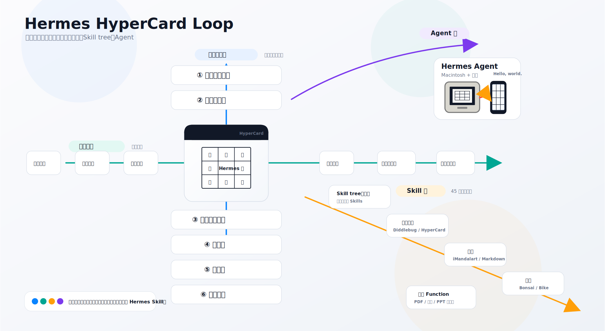

# 永錫 Agent Skill 庫

這個資料夾整理已成熟、可分享、可放進 GitHub，也適合在新書中連結引用的 Codex Skills。

## Hermes HyperCard Loop



這張圖說明目前核心技能在 Hermes Loop 中的位置：時間管理、卡片盒、Skill tree 與 Agent 四條軸如何交會。

## Core Skills

| Skill | 用途 | 入口 |
|---|---|---|
| 個人運動員81宮格 | 參考大谷翔平 81 宮格，產生可編輯 JSON 與大谷風格 SVG 的個人運動員訓練圖 | [`skills/personal-athlete-81-grid/`](skills/personal-athlete-81-grid/) |
| 自動魯曼編號機 | 為書稿與卡片盒分配魯曼式編號，清理公開案例 catalog，並附 EPUB 使用手冊 | [`skills/auto-luhmann-numberer/`](skills/auto-luhmann-numberer/) |
| JSON 到 EPUB | 把結構化專案筆記 JSON 轉成可驗證的 EPUB | [`skills/project-note-json-to-epub/`](skills/project-note-json-to-epub/) |
| Graph view | 從 JSON、索引、TOC、卡片資料產生 Obsidian 風格關係圖 | [`skills/obsidian-graph-view/`](skills/obsidian-graph-view/) |
| 九宮格 / iMandalArt | 產生九宮格、曼陀羅卡、Hermes/Discord 文字卡 | [`skills/imandalart/`](skills/imandalart/) |
| Markdown / Obsidian 九宮格 | 把素材、iMandalArt 或八領域草稿轉成可在 Obsidian、AIDA、GitHub 渲染的 Markdown 九宮表格 | [`skills/markdown-nine-grid-clipboard/`](skills/markdown-nine-grid-clipboard/) |
| FIRE 原則 | 以 Fact、Index、Relation、Encyclopedia 分析中文文章 | [`skills/fire-analysis-card/`](skills/fire-analysis-card/) |
| PDCA / CAPD 方位卡 | 把問題、事件、決策取捨轉成中文方位羅盤式 PDCA/CAPD 文字圖卡 | [`skills/pdca/`](skills/pdca/) |

## Repo Layout

```text
skills/      正式 Skills
docs/        GitHub、安裝、書籍連結說明
examples/    未來放每個 Skill 的輸入與輸出範例
archive/     舊版或暫不公開的 Skill 草稿
```

## Install Locally

把需要的 Skill 複製到 Codex skills 目錄：

```bash
cp -R skills/personal-athlete-81-grid ~/.codex/skills/
cp -R skills/auto-luhmann-numberer ~/.codex/skills/
cp -R skills/project-note-json-to-epub ~/.codex/skills/
cp -R skills/obsidian-graph-view ~/.codex/skills/
cp -R skills/imandalart ~/.codex/skills/
cp -R skills/markdown-nine-grid-clipboard ~/.codex/skills/
cp -R skills/fire-analysis-card ~/.codex/skills/
cp -R skills/pdca ~/.codex/skills/
```

更多說明見 [`docs/install.md`](docs/install.md)。

## For VS Code Editing

用 VS Code 開啟這個資料夾：

```bash
code .
```

建議每次修改後驗證 Skill：

```bash
python3 ~/.codex/skills/.system/skill-creator/scripts/quick_validate.py skills/markdown-nine-grid-clipboard
```

## Book Links

未來新書可以把每個章節連到固定 GitHub URL。正式 repo：

https://github.com/twhsi/skills

書籍用連結整理在 [`docs/book-links.md`](docs/book-links.md)。
